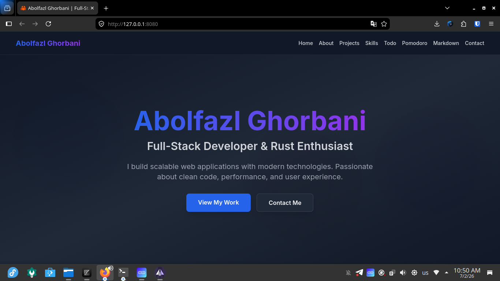
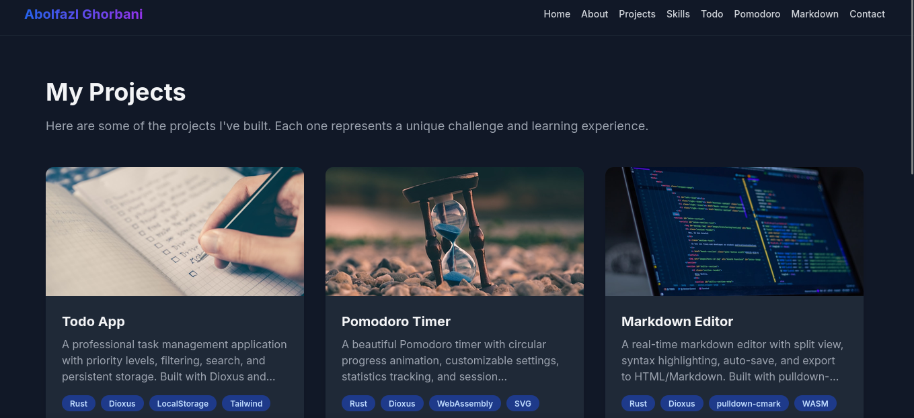

# 🦀 Abolfazl Ghorbani - Portfolio

<div align="center">


**Modern Portfolio Website built with Rust & Dioxus**

[Live Demo (GitLab)](https://abolfazlghorbani369.gitlab.io/aportfolio/) •
[Live Demo (GitHub)](https://abolfazlghorbani369.github.io/aportfolio/) •
[Source Code](https://gitlab.com/abolfazlghorbani369/aportfolio)

</div>

---

## ✨ Features

- 🎨 **Modern UI/UX** - Clean, professional design with smooth animations
- 🌓 **Dark Mode** - Automatic theme switching with system preference
- 📱 **Fully Responsive** - Mobile-first design with hamburger menu
- ⚡ **Lightning Fast** - Built with Rust and WebAssembly
- 🎯 **Multiple Apps** - Portfolio, Todo, Pomodoro Timer, Markdown Editor
- 💾 **Local Storage** - Persistent data across sessions
- 🚀 **Production Ready** - Optimized build with minimal bundle size

## 🛠️ Tech Stack

- **Language:** Rust (2024 Edition)
- **Framework:** Dioxus 0.7
- **Styling:** Tailwind CSS
- **Build Tool:** Trunk
- **Target:** WebAssembly (WASM)

## 📦 Projects Included

1. **Portfolio Website** - This website itself!
2. **Todo App** - Task management with filters and search
3. **Pomodoro Timer** - Focus timer with statistics
4. **Markdown Editor** - Real-time editor with preview

## 🚀 Getting Started

### Prerequisites

```bash
# Install Rust
curl --proto '=https' --tlsv1.2 -sSf https://sh.rustup.rs | sh

# Install Dioxus CLI
cargo install dioxus-cli

# Install Trunk
cargo install trunk
```

### Development

```bash
# Clone repository
git clone https://gitlab.com/abolfazlghorbani369/aportfolio.git
cd aportfolio

# Start development server
dx serve
```

Visit `http://localhost:8080`

### Production Build

```bash
# Build for production
dx build --release

# Output will be in ./dist/
```

## 🌐 Deployment

### GitLab Pages

1. Push to GitLab repository
2. CI/CD pipeline will automatically build and deploy
3. Access at: `https://abolfazlghorbani369.gitlab.io/aportfolio/`

### GitHub Pages

1. Push to GitHub repository
2. GitHub Actions will automatically build and deploy
3. Access at: `https://abolfazlghorbani369.github.io/aportfolio/`

## 📁 Project Structure

```
src/
├── components/     # Reusable UI components
│   ├── button.rs
│   ├── input.rs
│   ├── modal.rs
│   ├── project_card.rs
│   └── ...
├── pages/          # Route-based pages
│   ├── home.rs
│   ├── about.rs
│   ├── projects.rs
│   └── ...
├── hooks/          # Custom hooks
│   ├── use_theme.rs
│   ├── use_local_storage.rs
│   └── ...
├── state/          # Global state management
├── services/       # API calls
├── utils/          # Helper functions
├── models/         # Data models
├── styles/         # CSS styles
├── app.rs          # Main app component
└── main.rs         # Entry point
```

## 🎯 Features in Detail

### Dark Mode
- Automatic detection of system preference
- Manual toggle with localStorage persistence
- Smooth transitions between themes

### Mobile Menu
- Animated hamburger icon
- Slide-down menu with overlay
- Auto-close on link click
- Touch-friendly interface

### Todo App
- Add, edit, delete tasks
- Priority levels (Low, Medium, High)
- Filter by status and priority
- Search functionality
- LocalStorage persistence

### Pomodoro Timer
- Circular progress animation
- Customizable work/break durations
- Session statistics
- Sound notifications
- LocalStorage persistence

### Markdown Editor
- Real-time preview
- Split view (editor + preview)
- Export to HTML/Markdown
- Auto-save functionality
- Toolbar with common actions

## 🔧 Configuration

### Build Optimization

The project uses optimized build settings:

```toml
[profile.release]
opt-level = "z"      # Optimize for size
lto = true           # Link Time Optimization
codegen-units = 1    # Single codegen unit
panic = "abort"      # Smaller binary
strip = true         # Remove debug symbols
```

### Browser Support

- Chrome/Edge 90+
- Firefox 88+
- Safari 14+
- Mobile browsers (iOS Safari, Chrome Mobile)

## 📝 License

MIT License - see [LICENSE](LICENSE) for details

## 🤝 Contributing

Contributions, issues, and feature requests are welcome!

1. Fork the project
2. Create your feature branch (`git checkout -b feature/AmazingFeature`)
3. Commit your changes (`git commit -m 'Add some AmazingFeature'`)
4. Push to the branch (`git push origin feature/AmazingFeature`)
5. Open a Pull Request

## 📧 Contact

Abolfazl Ghorbani - [@abolfazlghorbani369](https://gitlab.com/abolfazlghorbani369)

Project Link: [https://gitlab.com/abolfazlghorbani369/aportfolio](https://gitlab.com/abolfazlghorbani369/aportfolio)

## 🙏 Acknowledgments

- [Dioxus](https://dioxuslabs.com/) - Amazing Rust framework
- [Rust](https://www.rust-lang.org/) - The programming language
- [Tailwind CSS](https://tailwindcss.com/) - Utility-first CSS framework

---

<div align="center">

**Built with ❤️ using Rust & Dioxus**

⭐ Star this repo if you like it!

</div>

## Project Screenshots

### Homepage


### My Project

