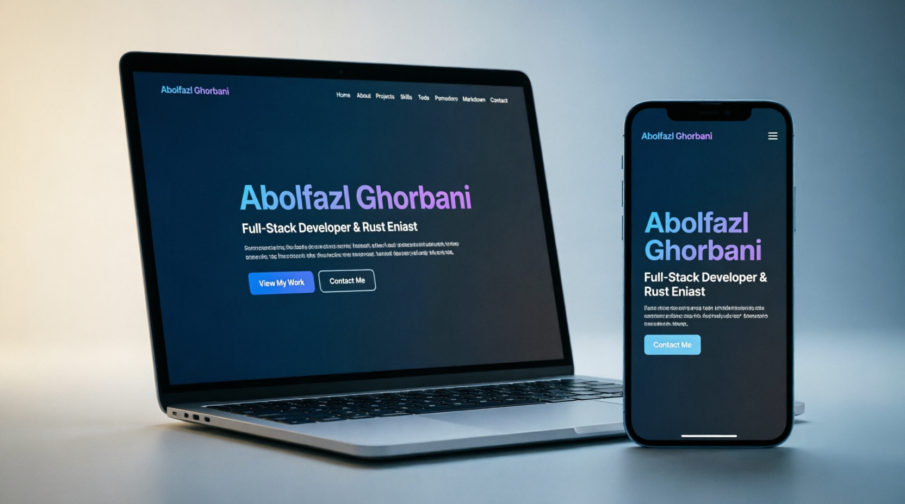

<div align="center">
  
  
  <h1>⚡ Rustam</h1>
  <p><b>High-Performance Portfolio built with Rust, WebAssembly, and Dioxus.</b></p>
  
  <p>
    
    
    
    
  </p>
  
  <p>
    <a href="https://github.com/aghorbani84/rustam"><b>Source Code</b></a> • 
    <a href="https://aghorbani84.github.io/rustam/"><b>Live Demo 🚀</b></a>
  </p>
</div>

---

### 🧠 About The Project
**Rustam** is a blazing-fast, web-based portfolio built entirely with Rust. It leverages the Dioxus framework to compile Rust code directly to WebAssembly (WASM), providing a highly interactive, zero-JavaScript, fully type-safe user experience.

### ✨ Key Features
- 🦀 **100% Rust:** Built from the ground up using Rust and Dioxus. No JavaScript frameworks.
- ⚡ **WebAssembly Powered:** Compiles to WASM for near-native performance in the browser.
- 🎨 **Modern UI:** Dark glassmorphism aesthetic with responsive design.
- 📱 **Fully Responsive:** Optimized for mobile, tablet, and desktop.
- 🔗 **Dynamic Project Showcase:** Easily manageable project cards with live demo links.

### 🛠️ Built With
- **Rust** (Systems Programming)
- **Dioxus** (React-like UI framework for Rust)
- **WebAssembly (WASM)** (Compilation target)
- **Tailwind CSS** (Styling)

### 🚀 Quick Start
To run this project locally, ensure you have Rust and the Dioxus CLI installed.

```bash
# Clone the repository
git clone https://github.com/aghorbani84/rustam.git
cd rustam

# Install Dioxus CLI (if you haven't already)
cargo install dioxus-cli --locked

# Add WASM target
rustup target add wasm32-unknown-unknown

# Run the development server
dx serve
 
Visit http://localhost:8080 in your browser.
📄 License

Distributed under the MIT License. See LICENSE for more information.
<div align="center">
  <b>Built with Rust & ❤️</b>
</div>
